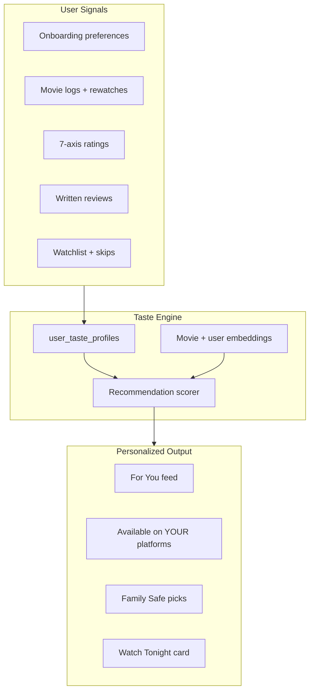
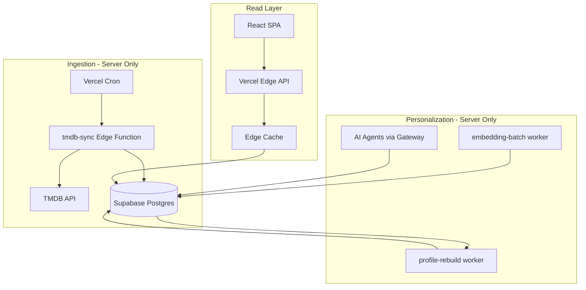
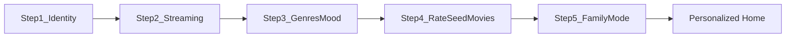
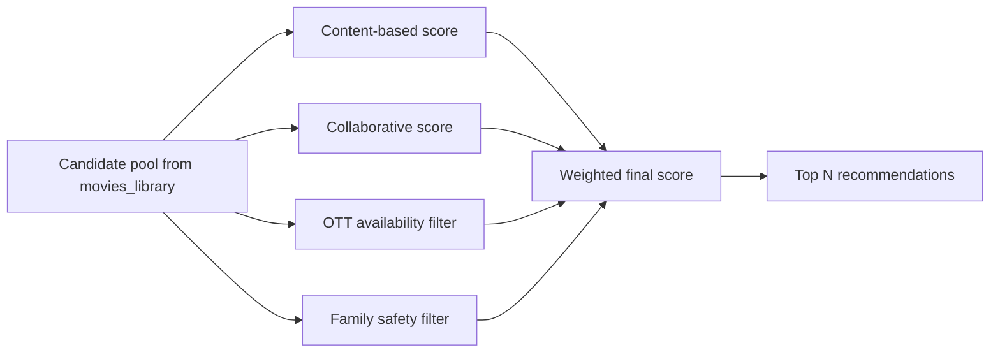
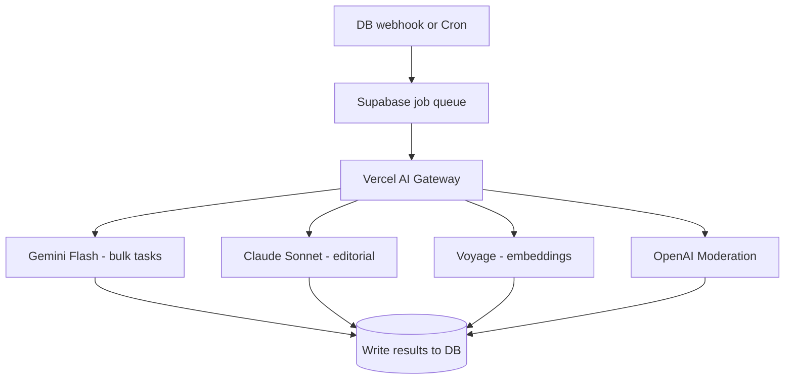

# TheaterOrStream — Production Architecture & Product Redesign Plan

**Branch:** `main` · **HEAD:** `a332f85` · **Progress:** 13 / 14 tasks complete

**Next recommended:** `ai-agents-stack` (Task #14)

---

## Master Task List

| # | ID | Task | Phase | Status |
|---|-----|------|-------|--------|
| 1 | `fix-upcoming-db` | Replace upcoming.jsx TMDB loop with `getUpcomingFromDb()`; year/month filters | 1 | ✅ **Done** |
| 2 | `slim-hydration` | Slim homepage hydration; remove base64 from admin sync | 1 | ✅ **Done** |
| 3 | `edge-read-api` | Vercel Edge `/api/content/*` + CDN cache; wire public pages | 1 | ✅ **Done** |
| 4 | `db-migrations` | `content_snapshots`, sync tables, RLS; run production optimization SQL | 1–2 | ✅ **Done** (Supabase, May 2026) |
| 5 | `server-tmdb-proxy` | Move TMDB key server-side; admin-only proxy route | 1–2 | ✅ **Done** |
| 6 | `automated-sync` | Vercel Cron + delta sync → `movies_library` | 2 | ✅ **Done** |
| 7 | `admin-control-tower` | Admin dashboard: sync history, content_events, settings in DB | 2 | ✅ **Done** |
| 8 | `unify-content-api` | Remove TMDB fallbacks; full Edge adoption | 1 | ✅ **Done** |
| 9 | `onboarding-redesign` | 5-step onboarding: OTT, genres, moods, seed ratings, family mode | 3 | ✅ **Done** |
| 10 | `taste-profile-schema` | Profile rebuild worker + embedding backfill (core tables shipped in #9) | 3 | ✅ **Done** |
| 11 | `recommendation-engine` | Hybrid reco + `/api/recommendations/for-you` | 4 | ✅ **Done** |
| 12 | `ux-redesign` | Personalized home, Watch Tonight, Family hub, Decision Mode | 5 | ✅ **Done** |
| 13 | `phase3-social-schema` | Diary logs, badges, activity feed, following feed | 6 | ✅ **Done** |
| 14 | `ai-agents-stack` | Taste Summarizer, Parent Guide, Editorial, Moderation agents | 7 | ⬜ b53aad7 |

**Legend:** ✅ Done · 🔄 Partial · ⬜ b53aad7

**Next recommended:** `ai-agents-stack` (Task #14)

**Task sync:** After every completed task or `git pull`, update this file + [implementation-work-log.md](./implementation-work-log.md) + [Cursor plan](~/.cursor/plans/tos_production_architecture_e5360011.plan.md). See [task-list-sync rule](../.cursor/rules/task-list-sync.mdc).

---

## Product North Star

**Problem to solve:** Users spend 20+ minutes scrolling Netflix/Prime/Hotstar and still can't decide what to watch.

**New positioning:** A personalized movie decision engine — not a movie catalog. Users log what they watch, rate across dimensions, and the app learns their taste to answer:

- *"What should I watch tonight on Netflix?"*
- *"Something like Interstellar but lighter"*
- *"Family movie night — safe for my 8-year-old"*



**What exists today that we build on:**
- 7-axis ratings in [`UserRatingSystem.jsx`](src/components/UserRatingSystem.jsx) (`acting`, `pacing`, `screenplay`, etc.) — gold for taste profiling
- `custom_parent_guide` + [`ParentGuide.jsx`](src/components/ParentGuide.jsx) — family-friendly foundation
- `streaming_platforms` on [`movies_library`](supabase_movies_library_schema.sql) — OTT availability data
- Basic onboarding in [`OnboardingPage.jsx`](src/views/OnboardingPage.jsx) — username/DOB/avatar only; `favorite_genres` in schema but **never collected**
- CMS-driven homepage in [`Home.jsx`](src/views/Home.jsx) — same for every user; must become personalized

---

## Current Technical State (Backend)

You already have the right **content model**: TMDB is ingestion, `movies_library` is runtime source of truth.

### Fixed in Phase 1 (deployed on `main`)

| Item | Status | How |
|------|--------|-----|
| Upcoming page TMDB loop | ✅ Fixed | [`upcoming.jsx`](src/views/upcoming.jsx) → `getUpcomingFromEdge` / DB |
| Heavy `images` JSONB on homepage | ✅ Fixed | Slim `LIBRARY_CARD_SELECT` hydration in [`supabase.js`](src/lib/supabase.js) |
| Base64 images in admin sync | ✅ Fixed | Removed from Sync Upcoming + AdminSections |
| Client-only caching (shared) | ✅ Improved | Vercel Edge `/api/content/*` with CDN cache headers |
| Public reads via Edge | ✅ Live | [`contentEdgeApi.js`](src/lib/contentEdgeApi.js) on Home, TV, Upcoming, Search, Details |
| DB migrations + RLS | ✅ Applied | `content_snapshots`, sync tables, production optimization SQL (Supabase, May 2026) |

### Resolved (Phase 1–2)

| Issue | Resolution |
|-------|------------|
| Public TMDB fallbacks | Removed — all public reads via Edge + `contentEdgeApi.js` |
| TMDB key in client bundle | Server-side proxy (`/api/tmdb/*`); admin/cron only |
| No scheduled sync | Vercel Cron (Fridays) + admin control tower manual trigger |
| Explore direct DB reads | `api/content/explore` + `api/content/trending` Edge routes |

**Stack:** React SPA on Vercel · Supabase Postgres · Edge functions in [`api/content/`](api/content/)

---

## Target Architecture (Supabase + Vercel)



**Principles:**
1. TMDB never called from browser in production
2. Recommendations computed server-side; cached per user
3. AI runs on batch/background paths only — never on every page load
4. Family-safe filtering is a **hard constraint**, not an afterthought

---

## Phase 1 — Fix Slow Loads + DB-First (Weeks 1–2)

**Status: mostly complete** — see [implementation-work-log.md](./implementation-work-log.md)

### 1.1 Frontend quick wins
- [x] Switch [`upcoming.jsx`](src/views/upcoming.jsx) → `getUpcomingFromDb()` / Edge
- [x] Remove public TMDB fallbacks from Details, Explore, Search
- [x] Slim homepage hydration (no base64 `images` JSONB)
- [~] Unify reads through Edge + [`contentEdgeApi.js`](src/lib/contentEdgeApi.js) (Home, TV, Upcoming, Search, Details done; **Explore still on `contentApi.js`**)

### 1.2 Vercel Edge read API ✅

| Route | Purpose | Cache | File |
|-------|---------|-------|------|
| `GET /api/content/homepage` | Hydrated homepage sections | `s-maxage=300` | [`api/content/homepage.js`](api/content/homepage.js) |
| `GET /api/content/tv-sections` | Hydrated TV sections | `s-maxage=300` | [`api/content/tv-sections.js`](api/content/tv-sections.js) |
| `GET /api/content/upcoming` | Upcoming by year/month | `s-maxage=600` | [`api/content/upcoming.js`](api/content/upcoming.js) |
| `GET /api/content/movie/:tmdbId` | Detail + streaming + parent guide | `s-maxage=3600` | [`api/content/movie/[tmdbId].js`](api/content/movie/[tmdbId].js) |
| `GET /api/content/search?q=` | Full-text search | `s-maxage=120` | [`api/content/search.js`](api/content/search.js) |

Shared logic: [`api/_lib/content-server.js`](api/_lib/content-server.js) · Client: [`src/lib/contentEdgeApi.js`](src/lib/contentEdgeApi.js)

### 1.3 Database + security ✅ (applied in Supabase)

- [x] `content_snapshots`, `tmdb_sync_runs`, `tmdb_sync_state`, `content_events`
- [x] RLS fixes on `movies_library`, sections tables
- [x] `supabase_production_optimization.sql` run

*Completed manually via Supabase SQL Editor (May 2026).*

---

## Phase 2 — Automated Content Pipeline (Weeks 3–4)

*Keeps library fresh with minimal TMDB usage — enables recommendations on complete data.*

### Scheduled jobs (Vercel Cron → Supabase Edge Function)

| Job | Schedule | Action |
|-----|----------|--------|
| `trending-daily` | Every 6h | Delta upsert trending IDs |
| `now-playing-daily` | Daily | In-theaters by region |
| `upcoming-weekly` | Weekly | New release announcements |
| `streaming-availability` | Weekly | Refresh `streaming_platforms` per region (TMDB watch/providers) |
| `parent-guide-enrich` | On new ingest | AI fills `custom_parent_guide` gaps |
| `snapshot-rebuild` | After sync | Rebuild `content_snapshots` |

### Admin becomes control tower
- Sync history, content_events queue, AI draft approvals
- Settings persisted to Supabase (not localStorage)

---

## Phase 3 — User-Driven Onboarding & Taste Profiles (Weeks 5–7)

### 3.1 Redesigned onboarding flow

Replace the current 3-step flow ([`OnboardingPage.jsx`](src/views/OnboardingPage.jsx): username → DOB → avatar) with a **5-step taste bootstrapping wizard**:



| Step | Collects | Why |
|------|----------|-----|
| **1. Identity** | Username, avatar, region | Existing + region drives OTT availability |
| **2. Your Platforms** | Netflix, Prime, Hotstar, Disney+, etc. (multi-select) | Core OTT filter — "show me only what I can watch" |
| **3. Taste Seeds** | Favorite genres (pick 5), preferred moods (cozy, intense, funny), languages | Cold-start before enough logs exist |
| **4. Rate 10 Movies** | Swipe or 7-axis mini-rate on popular titles from library | Instant signal — which dimensions they care about |
| **5. Family Mode** | "Watching with kids?" → age brackets, max certification (PG, PG-13), content limits | Enables family-safe recommendations |

**UX principles:**
- Progress bar + skip option (but fewer recommendations until profile fills)
- Each step shows immediate value preview ("Based on this, you'd love…")
- Mobile-first; onboarding is the product's first impression

### 3.2 User taste profile schema

```sql
-- Extends user_profiles (already has favorite_genres TEXT[] — start using it)
CREATE TABLE user_streaming_services (
  user_id uuid REFERENCES auth.users,
  service_id text NOT NULL,        -- 'netflix', 'prime', 'hotstar', 'disney_plus'
  region text NOT NULL DEFAULT 'IN',
  is_active boolean DEFAULT true,
  PRIMARY KEY (user_id, service_id)
);

CREATE TABLE user_taste_profiles (
  user_id uuid PRIMARY KEY REFERENCES auth.users,
  -- Genre affinities (computed + declared)
  genre_weights jsonb DEFAULT '{}',           -- {"28": 0.85, "18": 0.72} action, drama
  mood_preferences jsonb DEFAULT '{}',          -- {"cozy": 0.9, "intense": 0.3}
  -- 7-axis taste vector (avg of high-rated movies)
  axis_preferences jsonb DEFAULT '{}',        -- {"pacing": 7.2, "acting": 8.1, ...}
  -- Behavioral patterns
  avg_rating_given numeric(3,1),
  rating_count int DEFAULT 0,
  log_count int DEFAULT 0,
  preferred_runtime_range int4range,            -- e.g. [90, 150]
  preferred_decades int[],                    -- [2010, 2020]
  preferred_languages text[],
  -- Family mode
  family_mode_enabled boolean DEFAULT false,
  family_max_certification text,                -- 'PG', 'UA', etc.
  family_content_limits jsonb,                -- {"violence": "mild", "nudity": "none"}
  -- AI-generated summary (refreshed weekly)
  taste_summary text,                         -- "You love slow-burn sci-fi with strong acting..."
  embedding vector(512),                      -- pgvector for similarity search
  -- Metadata
  profile_version int DEFAULT 1,
  last_computed_at timestamptz,
  onboarding_completed_at timestamptz
);

CREATE TABLE user_interactions (
  id uuid PRIMARY KEY DEFAULT gen_random_uuid(),
  user_id uuid NOT NULL,
  tmdb_id text NOT NULL,
  interaction_type text NOT NULL,  -- 'view', 'click', 'skip', 'add_watchlist', 'remove_watchlist', 'share'
  context jsonb,                 -- {"source": "for_you", "position": 3}
  created_at timestamptz DEFAULT now()
);
CREATE INDEX idx_interactions_user ON user_interactions(user_id, created_at DESC);

-- Movie-side embeddings for content-based filtering
ALTER TABLE movies_library ADD COLUMN IF NOT EXISTS embedding vector(512);
ALTER TABLE movies_library ADD COLUMN IF NOT EXISTS family_score numeric(3,1); -- 0-10, higher = more family friendly
ALTER TABLE movies_library ADD COLUMN IF NOT EXISTS mood_tags text[];         -- ['cozy', 'mind-bending', 'feel-good']
```

**Requires:** Enable `pgvector` extension in Supabase.

### 3.3 Profile rebuild worker

Triggered on: new rating, new log, onboarding complete, weekly cron.

```
profile-rebuild Edge Function:
  1. Query user's ratings, logs, watchlist, skips (last 90 days)
  2. Compute genre_weights from high-rated (≥7) vs low-rated (≤4) movies
  3. Compute axis_preferences as weighted avg of 7-axis ratings
  4. Detect patterns: "rates pacing highly", "avoids horror", "prefers 90-120min"
  5. Update user_taste_profiles row
  6. (Weekly) Call Taste Summarizer AI → taste_summary text
  7. (Weekly) Refresh user embedding via embedding API
```

---

## Phase 4 — Recommendation Engine (Weeks 7–9)

### 4.1 Hybrid scoring (production-grade, no AI on hot path)



**Scoring formula (per movie, per user):**

```
final_score =
  0.40 × content_similarity(user_embedding, movie_embedding)
+ 0.25 × genre_match(user.genre_weights, movie.genres)
+ 0.15 × axis_match(user.axis_preferences, community_ratings)
+ 0.10 × collaborative(users_like_you_also_rated)
+ 0.10 × popularity_boost
```

**Hard filters (never soft-scored):**
- Must be on ≥1 of user's `user_streaming_services` (if OTT mode)
- Must pass `family_content_limits` when family mode on
- Must be `is_active = true` in library

**Candidate pools by use case:**

| Use Case | Pool | Endpoint |
|----------|------|----------|
| **For You** | Full library, personalized rank | `GET /api/recommendations/for-you` |
| **Watch Tonight** | Unwatched + runtime ≤120min + on your OTT | `GET /api/recommendations/tonight` |
| **Because You Liked X** | Similar embeddings + same genres | `GET /api/recommendations/similar/:tmdbId` |
| **Family Picks** | `family_score ≥ 7` + cert ≤ user max | `GET /api/recommendations/family` |
| **Trending For You** | Trending ∩ your taste profile | `GET /api/recommendations/trending-personalized` |

### 4.2 Recommendation cache

```sql
CREATE TABLE recommendation_cache (
  user_id uuid,
  cache_key text,           -- 'for_you', 'tonight', 'family'
  payload jsonb NOT NULL,
  expires_at timestamptz,
  PRIMARY KEY (user_id, cache_key)
);
```

- Rebuild on profile change or every 6 hours
- Edge API serves cached reco (<50ms)
- Stale cache OK with `stale-while-revalidate`

### 4.3 Collaborative filtering (at scale)

**Phase 4a (launch):** Item-item similarity via embeddings + genre overlap
**Phase 4b (10k+ users):** Matrix factorization offline (Python job on Hugging Face Jobs or Supabase Edge batch)
**Phase 4c (100k+ users):** Precomputed `users_like_you` clusters refreshed nightly

### 4.4 "Why this?" explanations (AI, cached)

After ranking, top 5 results get a one-line explanation generated once and cached:

> *"Recommended because you rated high on slow-paced sci-fi and this is on your Prime Video"*

Generated by **Taste Explainer Agent** (cheap model, batch only).

---

## Phase 5 — Full Site Redesign (Weeks 8–12)

### 5.1 Information architecture shift

**From:** CMS sections (Trending, Now Playing, Netflix…) — same for everyone
**To:** Personalized hub with editorial as secondary

| New Route | Purpose | Replaces |
|-----------|---------|----------|
| `/` (Home) | **Your Feed** — For You, Watch Tonight, Continue Watching | CMS homepage |
| `/discover` | Mood + genre discovery with filters | Explore |
| `/family` | Family-safe hub with age filters | — (new) |
| `/platforms` | Browse by YOUR streaming services | — (new) |
| `/tonight` | "Help me decide" — 3 picks max, swipe to choose | — (new) |
| `/movie/:slug` | Detail + log + rate + "where to watch" | Details (enhanced) |
| `/diary` | Your watch log (Letterboxd-style) | WatchedMovies |
| `/feed` | Following activity feed | ActivityFeed |
| `/theaters` | In-theaters (regional, editorial) | Old Home sections |
| `/upcoming` | DB-driven upcoming | upcoming.jsx |

### 5.2 Core UI components (new)

| Component | Purpose |
|-----------|---------|
| `WatchTonightCard` | Single decisive recommendation with OTT badge + "Why this?" |
| `TasteProfileBar` | Visual genre/mood bars on profile |
| `OTTAvailabilityPill` | Netflix/Prime icons on every card |
| `FamilySafeBadge` | Green shield when passes family filters |
| `QuickLogModal` | Rate + log in 2 taps after watching |
| `DecisionMode` | Tinder-style swipe between 2-3 options → pick one |
| `MoodPicker` | Filter discover by mood tags |

### 5.3 Homepage wireframe (logged-in user)

```
┌─────────────────────────────────────────────┐
│  🎬 Watch Tonight          [Decision Mode]  │
│  ┌─────────────────────────────────────┐    │
│  │  Dune: Part Two — on Prime Video    │    │
│  │  "Slow sci-fi with strong acting"     │    │
│  │  [Log It] [Not Tonight] [See Why]    │    │
│  └─────────────────────────────────────┘    │
│                                             │
│  For You                          See all → │
│  [card] [card] [card] [card] →              │
│                                             │
│  On Your Netflix                  See all → │
│  [card] [card] [card] [card] →              │
│                                             │
│  Family Picks (if enabled)        See all → │
│  [card] [card] [card] [card] →              │
│                                             │
│  In Theaters This Week            See all → │
│  [card] [card] [card] [card] →              │
└─────────────────────────────────────────────┘
```

**Logged-out users:** Taste quiz lite → sample recommendations → sign up CTA.

### 5.4 Family-friendly as first-class feature

Build on existing [`ParentGuide.jsx`](src/components/ParentGuide.jsx) + `custom_parent_guide`:

**Movie-side (automated):**
- `family_score` computed from: certification + parent guide levels + genres (animation/family boost)
- AI Parent Guide Enricher fills gaps where TMDB data is missing
- Admin can override in [`AdminMovieEditorPage.jsx`](src/views/admin/AdminMovieEditorPage.jsx)

**User-side:**
- Family mode toggle in onboarding + settings
- Age bracket selector (5-8, 9-12, 13+)
- Hard filter: no movie shown if any parent guide category exceeds user's limit
- Dedicated `/family` page with kid-friendly UI variant (optional theme)

**Trust signal on cards:**
```
🛡️ Family Safe · PG · No violence · On Disney+
```

---

## Phase 6 — Social + Gamification (Weeks 12–16)

Builds on prior Phase 3 social plan with tighter integration to taste engine:

### 6.1 Movie diary (replaces binary watched toggle)

```sql
CREATE TABLE movie_logs (
  id uuid PRIMARY KEY,
  user_id uuid REFERENCES auth.users,
  tmdb_id text NOT NULL,
  media_type text,
  watched_on date NOT NULL,
  rating numeric(3,1),
  review_text text,
  rewatch_count int DEFAULT 0,
  watched_with text[],           -- ['partner', 'kids', 'friends']
  visibility text DEFAULT 'public',
  created_at timestamptz DEFAULT now()
);
```

Every log triggers: profile rebuild + badge check + activity feed entry.

### 6.2 Social features

| Feature | Integration with taste engine |
|---------|-------------------------------|
| Following feed | Show friends' logs; "friends who liked this" boosts reco score |
| Public collections | "Curated for cozy nights" collections feed discover |
| Share cards | Include taste match % + OTT availability |
| Reddit-style badges | Genre milestones feed back into profile display |

### 6.3 Badge examples

- **First Reel** — log first movie
- **Family Night Hero** — 10 family-mode logs
- **Platform Explorer** — log movies from 5 different OTT services
- **Taste Maker** — 10 reviews with 5+ upvotes
- **Decisive** — use Decision Mode 20 times

---

## Phase 7 — AI Agents Stack (Recommended Models)

Use **Vercel AI Gateway** as a single routing layer (already in your Cursor skills). All keys server-side. AI never blocks user-facing reads.

### Agent catalog

| Agent | Job | Recommended Model | Why | When it runs |
|-------|-----|-------------------|-----|--------------|
| **Taste Summarizer** | Write `taste_summary` from profile stats | **Gemini 3 Flash** or **Claude Haiku 4.5** | Cheapest, fast, good prose | Weekly per active user |
| **Taste Explainer** | "Why recommended?" one-liner | **Gemini 3 Flash** | High volume, low cost | On reco cache rebuild |
| **Parent Guide Enricher** | Fill `custom_parent_guide` from overview + reviews | **GPT-4o-mini** or **Gemini 3 Flash** | Structured JSON output, reliable | On new movie ingest |
| **Mood Tagger** | Assign `mood_tags[]` to movies | **GPT-4o-mini** | Structured classification | Batch on library |
| **Editorial Agent** | Draft `editor_review`, `custom_vibes` | **Claude Sonnet 4.6** | Best quality prose | Admin queue, on ingest |
| **Trend Analyst** | Summarize trending + suggest section updates | **Claude Sonnet 4.6** | Reasoning over data | Daily cron |
| **Moderation Agent** | Flag toxic/spam reviews | **OpenAI Moderation API** (free) + **Llama Guard 3** fallback | Purpose-built, fast | On review submit |
| **Announcement Matcher** | Match studio RSS → TMDB ID | **Gemini 3 Flash** + fuzzy search | Cheap extraction | On RSS ingest |
| **Decision Assistant** | Conversational "what should I watch?" (Phase 7b) | **Claude Haiku 4.5** | Low latency chat | User-initiated, rate-limited |

### Embeddings for recommendations (critical — not an LLM)

| Provider | Model | Cost | Use |
|----------|-------|------|-----|
| **Voyage AI** | `voyage-3-lite` | ~$0.02/M tokens | Best cost/MTEB score for movie similarity |
| **Cohere** | `embed-v4.0` | ~$0.10/M tokens | Alternative; native rerank API |
| **OpenAI** | `text-embedding-3-small` | ~$0.02/M tokens | Simplest if already on OpenAI |

**Recommendation:** Start with **Voyage AI `voyage-3-lite`** for movie + user taste embeddings. Use **Cohere Rerank** on top-50 candidates if quality needs boost.

### What NOT to use AI for

| Task | Use instead |
|------|-------------|
| Ranking 1000s of movies per request | pgvector similarity + SQL scoring |
| OTT availability | TMDB watch/providers → `streaming_platforms` column |
| Family safety filter | Rule-based on `custom_parent_guide` + certification |
| Real-time feed | Postgres queries + cache |
| Every homepage load | Precomputed `recommendation_cache` |

### Estimated AI cost at scale

| Scale | Monthly AI cost (est.) |
|-------|------------------------|
| 1k users | $5–15 (mostly onboarding + weekly summaries) |
| 10k users | $30–80 |
| 100k users | $200–500 (batch summaries + moderation only) |

Keep LLM off the hot path → costs stay predictable.

### Agent architecture



---

## Phase 8 — Scale to Millions

| Layer | Strategy |
|-------|----------|
| **Reads** | Edge-cached snapshots + per-user reco cache |
| **Profile compute** | Async workers; never block HTTP |
| **Embeddings** | Batch nightly; incremental on new movies |
| **Collaborative** | Precomputed clusters at 100k+ users |
| **Search** | Postgres tsvector → Meilisearch at 1M+ movies |
| **Feed** | Fan-out on write (<10k followers); fan-out on read (celebrities) |
| **DB** | Supabase Pro + read replicas |

---

## Updated Execution Order

| Week | Focus |
|------|-------|
| 1–2 | Phase 1: DB-first perf fixes, Edge read API, RLS |
| 3–4 | Phase 2: Automated TMDB sync + streaming availability |
| 5–7 | Phase 3: Onboarding redesign + taste profile schema + profile worker |
| 7–9 | Phase 4: Recommendation engine + `/api/recommendations/*` |
| 8–12 | Phase 5: Full UX redesign — personalized home, Watch Tonight, Family hub |
| 12–16 | Phase 6: Social diary, badges, following feed |
| Ongoing | Phase 7: AI agents deployed incrementally with admin approval queues |

---

## Success Metrics (Updated)

| Metric | Today | Target |
|--------|-------|--------|
| Time to first recommendation (logged-in) | N/A | <500ms |
| Onboarding completion rate | ~unknown | >70% |
| "Watch Tonight" click-through | N/A | >25% |
| TMDB calls per visitor | 0–25+ | 0 |
| Family mode adoption | N/A | >15% of users |
| Repeat weekly visits | N/A | >40% of onboarded users |
| Decision Mode → log conversion | N/A | >50% |

---

## File Change Map (Full Product)

| Area | Key Files |
|------|-----------|
| Onboarding | [`src/views/OnboardingPage.jsx`](src/views/OnboardingPage.jsx) — full rewrite |
| Personalized home | [`src/views/Home.jsx`](src/views/Home.jsx) — rewrite as feed |
| New pages | `src/views/WatchTonight.jsx`, `FamilyHub.jsx`, `PlatformBrowse.jsx`, `DecisionMode.jsx` |
| Recommendations | `api/recommendations/for-you.js`, `supabase/functions/profile-rebuild/` |
| Taste schema | `supabase/migrations/002_taste_profiles.sql` |
| AI agents | `supabase/functions/agents/` (taste-summarizer, parent-guide, moderation) |
| Existing perf | [`upcoming.jsx`](src/views/upcoming.jsx), [`contentApi.js`](src/lib/contentApi.js), [`supabase.js`](src/lib/supabase.js) |
| Family UI | [`ParentGuide.jsx`](src/components/ParentGuide.jsx) — extend with family score badge |
| Ratings → profile | [`UserRatingSystem.jsx`](src/components/UserRatingSystem.jsx) — hook profile rebuild on submit |

---

## Summary

The app evolves from **"a movie catalog with CMS sections"** to **"your personal movie decision engine"**:

1. **Phase 1–2** fixes speed and automates content (foundation)
2. **Phase 3–4** learns who you are from ratings, logs, and onboarding
3. **Phase 5** redesigns the entire UX around *deciding what to watch* on *your* OTT platforms
4. **Family mode** is a hard-filtered, trust-first experience — not a tag
5. **Phase 6** adds Letterboxd social + Reddit badges that feed back into taste
6. **AI** handles summaries, explanations, parent guides, and moderation — never the ranking hot path
7. **Voyage embeddings + SQL scoring** do the heavy recommendation lifting at scale

This is production-viable on Supabase + Vercel without a separate backend service, and scales to millions by keeping personalization async and cached.

---

## Implementation Work Log

See [implementation-work-log.md](./implementation-work-log.md) for session-by-session changes, commits, and deploy notes.

### Completed (Phase 1–2 — as of May 2026, `main` @ `b42916d`)

| # | Task ID | Status | Summary |
|---|---------|--------|---------|
| 1 | `fix-upcoming-db` | ✅ | Removed ~25 TMDB calls per visit; loads from `movies_library` |
| 2 | `slim-hydration` | ✅ | Card-only projection; no base64 in admin sync |
| 3 | `edge-read-api` | ✅ | `/api/content/*` routes + CDN cache; `contentEdgeApi.js` |
| 4 | `db-migrations` | ✅ | Snapshots, sync tables, RLS — applied in Supabase (May 2026) |
| 5 | `server-tmdb-proxy` | ✅ | TMDB key server-side; admin `/api/tmdb/*` proxy |
| 6 | `automated-sync` | ✅ | Vercel Cron + delta sync → `movies_library` |
| 7 | `admin-control-tower` | ✅ | Sync history, events queue, DB settings |
| 8 | `unify-content-api` | ✅ | Explore + trending Edge routes; all public pages on Edge |

### Next up (Phase 3)

| # | Task ID | Priority |
|---|---------|----------|
| 9 | `onboarding-redesign` | **Next** — 5-step taste onboarding wizard |

### Later (Phase 3+)

| # | Task ID | Phase |
|---|---------|-------|
| 9 | `onboarding-redesign` | 3 |
| 10 | `taste-profile-schema` | 3 |
| 11 | `recommendation-engine` | 4 |
| 12 | `ux-redesign` | 5 |
| 13 | `phase3-social-schema` | 6 |
| 14 | `ai-agents-stack` | 7 |
